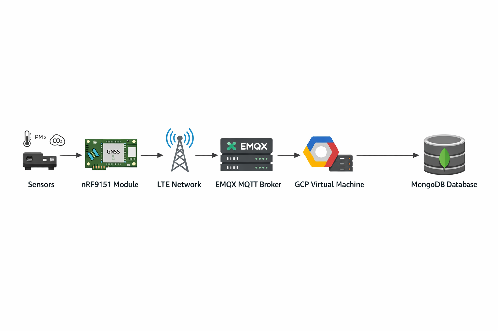

# LTE-based IoT Sensor System

An embedded-to-cloud system that collects environmental data using Nordic nRF9151 and transmits it to a cloud backend via LTE and MQTT.

---

## Full Documentation

For detailed implementation and full technical documentation:

[📄 View Full Technical Guide (Google Drive)](https://docs.google.com/document/d/1_5Lt2o4yYnwDdJkwNVkzcrS0I1ZkqhTu/edit?usp=sharing&ouid=100431925273316780165&rtpof=true&sd=true)

---

## Overview

This project is a custom embedded system designed to collect environmental data such as PM, CO2, temperature, and humidity, and transmit it to a cloud backend in real time.

The system integrates:

* Embedded firmware (nRF9151)
* LTE communication
* GNSS positioning
* MQTT data pipeline
* Cloud backend (GCP + MongoDB)

---

## System Architecture

Sensor → nRF9151 → LTE → MQTT Broker (EMQX) → GCP → MongoDB

---

## My Contributions

* Developed embedded firmware using Nordic nRF9151
* Implemented GNSS-based location acquisition
* Designed LTE communication workflow
* Built MQTT-based data transmission pipeline
* Deployed EMQX broker on GCP VM
* Designed MongoDB-based data storage architecture
* Implemented adaptive sensor sampling logic
* Designed watchdog-based system reliability

---

## Data Flow

1. Sensor data is collected periodically
2. GNSS retrieves location data
3. Device connects to LTE network
4. Data is formatted into JSON
5. MQTT publishes data to EMQX broker
6. Backend stores data in MongoDB

  

---

## Tech Stack

* Embedded C
* Nordic nRF9151 (LTE + GNSS)
* MQTT (EMQX)
* Google Cloud Platform (VM)
* MongoDB

---

## Key Features

* Adaptive sampling based on PM2.5 levels
* Power Saving Mode (PSM) optimization
* Multithreaded architecture for measurement and transmission separation
* Watchdog-based system reliability
* GNSS-based location tagging

---

## Results

* Successfully built end-to-end embedded-to-cloud pipeline
* Real-time environmental data transmission validated
* Stable LTE and MQTT communication achieved

---

